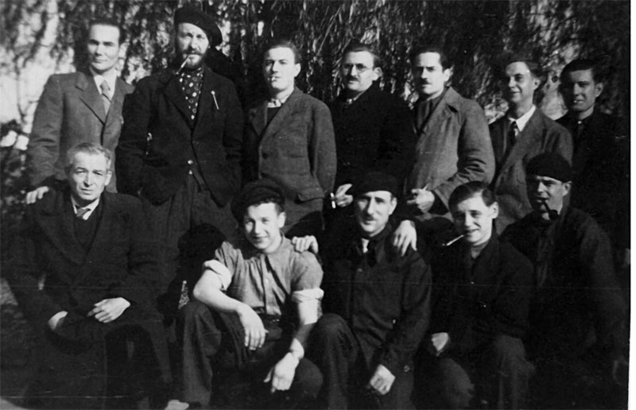
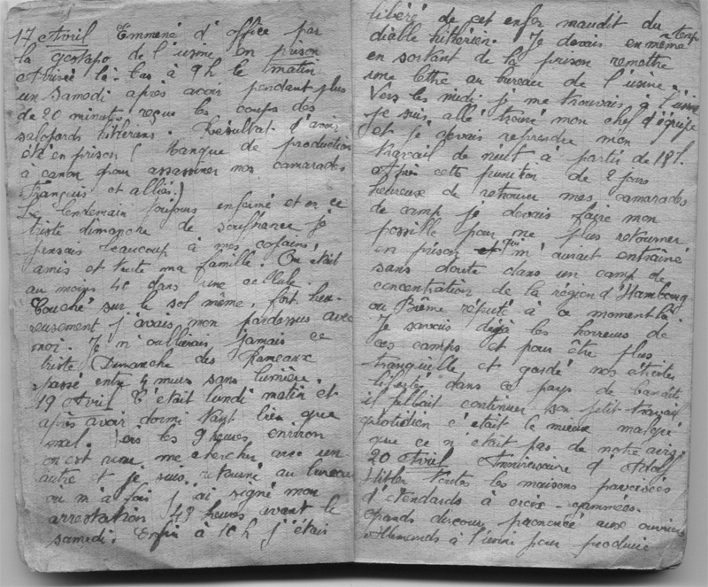
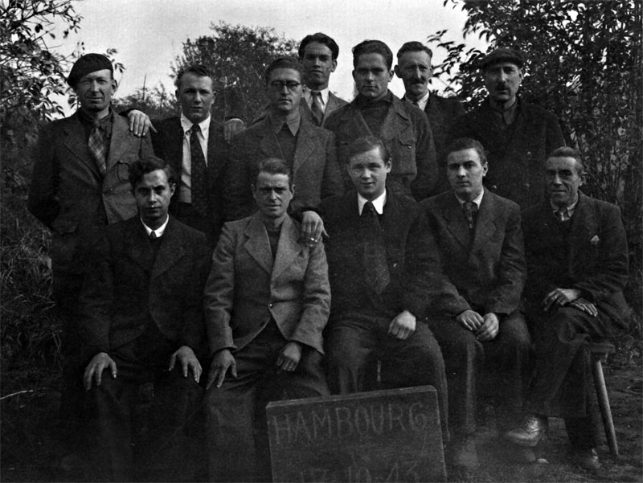

## [STO](https://fr.wikipedia.org/wiki/Service_du_travail_obligatoire_(France))

### Un crime de guerre

Il y a une soixantaine d’années, plus de cinquante-six millions de personnes
succombaient à la guerre la plus dévastatrice que cette planète ait connue.
Qu’en reste-t-il ? On a tous quelques souvenirs cinématographiques, de Nuit et
Brouillard au Jour le plus long. Quelques noms de villes viennent facilement à
l’esprit : Vichy, Bordeaux, Sainte-Mère-Eglise, Drancy... Quelques
personnalités aussi, de Jaurès à Pétain, de Jean Moulin à Papon. A peine une
pensée pour ces **six cents mille** Français marqués à vie par le Service du
Travail Obligatoire, cette déportation des populations civiles qui sera plus
tard reconnue crime de guerre et crime contre l’Humanité.

Ces Français, utilisés comme main d’oeuvre au service de la machine de guerre
allemande, ont été brinquebalés à travers l’Allemagne dans des conditions
souvent difficiles. Ils ont vécu sous les bombardements alliés, écartelés entre
l’angoisse de cette mort tombant du ciel et l’espoir d’une prochaine
délivrance, tiraillés entre le désir de vengeance et la compassion qu’ils ne
pouvaient qu’éprouver pour la population allemande lorsqu’ils virent le déluge
de millions de tonnes de bombes alliées s’abattre sur Hambourg, Berlin ou
Dresde.

<h3>Une histoire personnelle</h3>
Témoin involontaire de cette frénésie meurtrière, un homme
éprouva la nécessité de laisser un témoignage. Il coucha sur papier ses
impressions quelques mois après sa déportation. Pour ses futurs enfants. Pour
la génération suivante. Par devoir de mémoire. Peu après, il se mariait avec
une jeune Chalonnaise : ma grand-mère.

Un de ses petit-fils, de la génération de ceux qui ont eu vint ans en l’an deux
mille, cette génération qui n’a pas connu de conflit majeur et qui a vécu dans
une Europe globalement pacifiée, a eu envie de raviver cette mémoire, de la
sortir de ce carnet pour qu’elle revive une nouvelle fois, sous forme
électronique.

L’année de mes quinze ans, alors lycéen en banlieue parisienne, l’image d’un
certain Jacques Chirac s’affichait sur l’écran de télévision familial.
J’imposai le silence et écoutai le discours bien rodé du chef de l’État. La
sacro-sainte conscription, celle que Jean-Baptiste Jourdan avait soumise au
vote le dix-huit fructidor An V est abolie.

<blockquote>
 
Tout Français est soldat et se doit à la défense de la patrie

 <footer>Loi Jourdan-Delbrel</footer>
</blockquote>

Ce vingt-huit mai mille neuf cent quatre-vingt-seize, j’apprends que je ferai
partie de la première classe pour la journée d’appel de préparation à la
défense. Une unique journée et non plus dix mois. Quel soulagement !

<blockquote class="blockquote-reverse">
  
Mourons pour des idées, d'accord, mais de mort lente

  <footer>Georges Brassens, 1972</footer>
</blockquote>

Cinquante-six ans plus tôt, le roi Léopold III signait la capitulation de la
Belgique. Il serait rapidement imité par le Maréchal Pétain. D’octobre mille
neuf cent quarante à juin mille neuf cent quarante deux, la France occupée va
fournir cent cinquante-quatre mille volontaires pour partir travailler en
Allemagne. Mais Hitler a alors besoin d’une main d’oeuvre plus importante pour
soutenir l’effort de guerre. Très vite, le volontariat laissera place à la
réquisition. Celle-ci sera régie par la loi du **quatre septembre mille neuf cent
quarante-deux** qui met en place un Service du Travail Obligatoire.

## Convocation

### 7 janvier 1943

Première convocation. Jean, souffrant à ce moment là, évita le départ pour
l’Allemagne. Ce jeune Balbynien allant sur ses vingt ans put profiter d’un mois
de plus dans la cellule familiale. Mais, bien entendu, ce ne fut qu’un léger
différé, l’administration n’allait pas l’oublier aussi facilement. Il fut donc
rappelé le deux février où l’on lui notifia sa destination. Ce serait Hambourg.

### 9 février 1943

Malgré toute sa bonne volonté, il lui fut impossible de monter dans le train.
Celui-ci était complet. Pourquoi faire le jour même ce qu’on pouvait faire le
lendemain ? Le départ fut donc une nouvelle fois différé.

### 10 février 1943

Rebelote ! Sa soeur le poussa à partir quand même de peur qu’il soit considéré
comme déserteur. Mais il n’y eut rien à faire, à part rentrer chez soi.

### 11 février 1943

Une nouvelle fois, le coeur serré, Jean avait fait ses adieux à la famille.
Parti de bonne heure de Bobigny, il patienta jusqu’à seize heures avant le
départ du train à la gare de l’Est. Au terme d’un voyage d’une quarantaine
d’heures, le train déposa son chargement à Hambourg en date du treize février.
C’était le début d’un long séjour.

## Premiers jours

### 15 février 1943

Mise en bouche en douceur pour le premier jour d’usine, cela commença par une
séance de photographie puis, le ventre gargouillant (Jean n’eut le droit qu’à
un souper), il fallut se plier aux nécessités bureaucratiques. Ils durent vite
prendre l’habitude de travailler le ventre vide puisque les journées de travail
de dix à onze heures ne prenaient pas en compte leurs besoins physiologiques
primaires, les repas n’étant servis que le soir.

Ce fut le déclenchement d’un premier conflit. Pendant une semaine, les
travailleurs français, réclamèrent le droit à deux repas par jour. Ils
n’étaient, après tout, pas officiellement prisonniers. Ils étaient censés être
traités à la même enseigne que les travailleurs allemands. Finalement, ils
obtinrent satisfaction. Enfin, à moitié seulement puisque le week-end seul un
repas leur était distribué.

Pendant ce temps-là, Jean, après une formation éclair, exerçait le métier de
mécanicien.

### 14 mars 1943

On n’est pas sérieux quand on a dix-sept ans. On l’est un peu plus quand on
fête ses vingt ans dans le pays de l’occupant. Cela faisait bientôt un mois que
Jean avait été expatrié. Presque trois semaines qu’il avait rejoint le bâtiment
de soudure électrique. Le rythme de travail, jusqu’à présent déjà éprouvant,
allait encore s’accélérer. Chaque jour le calvaire débutait à dix-huit heures
tapantes et se terminait à six heures du matin. Avec, en tout et pour tout,
deux pauses d’une demi-heure dont celle du souper. Le rythme était d’autant
plus dur qu’il n’y avait pas ou presque de récupération, la semaine commençant
le lundi soir et finissant le dimanche matin.

## Prison et acte de resistance

### 17 avril 1943

La veille, Jean, n’ayant pas de travail à faire, sortit de l’usine et s’attarda
quelques minutes au bord du canal. Il fut brutalement ramené à la réalité par
un coup sur son épaule. “Ramonat !”, c’était le patron qui le rappelait à
l’ordre. Le samedi dix-sept avril, il fut convoqué dans le bureau du directeur
et s’attendait à recevoir un avertissement. Quelle ne fut pas sa surprise en
voyant un policier à son arrivée ! Ce jour-là, Jean fut emmené en prison par la
Gestapo. Motif : manque de production. Après s’être fait traiter de fainéant et
avoir reçu quelques coups ponctuant le message, il fut retenu captif. Quarante
par cellule, couchés à même le sol. Dur de dormir entre ces quatre murs, sur un
pardessus recyclé en sommier sommaire. On vint le chercher quarante-huit heures
après.

Le Lundi, à dix heures du matin, après avoir signé les paperasses allemandes
sur lesquelles était signifié son état d’arrestation, Jean se dirigea vers son
usine, une lettre de la Gestapo à la main. Cette fois, il s’agissait de ne plus
faire d’écart. Mieux valait être prudent si l’on voulait éviter les camps de
concentration. Au camp de travail, les hommes n’étaient pas dans l’ignorance
des pratiques atroces qui se déroulaient là-bas. Jean reprit son travail le
soir même à dix-huit heures, soulagé malgré tout.

### 20 avril 1943

Un grand jour pour l’Allemagne, cinquante quatre ans auparavant, Adolf Hitler
venait au monde. Un événement de telle ampleur devait être fêté comme il se
doit. Maisons arborant ostensiblement maints étendards de croix gammées, grands
orateurs haranguant les ouvriers allemands, ... L’Allemagne triomphante devait
plus que jamais redoubler d’efforts pour la victoire de la nouvelle Europe.

### 23 avril 1943

Quelques jours de relâchement pour les fêtes de Pâques. La nourriture fut
meilleure et les ouvriers disposèrent d’un jour férié. Ce fut l’occasion de
visiter le jardin zoologique de Hambourg. Cette visite étant agréable, les
hommes y retournèrent le vingt juin et le quatre juillet.

Malgré le premier avertissement de la Gestapo, Jean éprouvait de grosses
difficultés à être particulièrement productif tout en sachant que son labeur
servirait à assassiner ses proches, sa famille, son pays ou les pays alliés.
Tout en gardant un rythme de travail normal, il se rendit tous les soirs,
pendant deux mois, au bord du canal avec un camarade flamand. Son petit, mais
courageux, acte de résistance fut de couler nombre des pièces à canon qu’il
fabriquait en journée. Tous les soirs, le canal avalait une partie de la
production. Cette entreprise prit fin avec les premiers bombardements.

## [Opération Gomorrhe](https://fr.wikipedia.org/wiki/Opération_Gomorrhe)
### 24 juillet 1943

Sous ce doux nom
se cachait une série de raids aériens menés par la <abbr title="Royal Air
Force">RAF</abbr> sur Hambourg. Le vingt-quatre juillet à minuit
cinquante-sept, les bombardiers de la <abbr title="Royal Air Force">RAF</abbr>
larguèrent leurs bombes une heure durant. Puis, à quatorze heures quarante, ce
fut l’United States Army Air Force qui envoya cent vingt-deux B-17.

Jean ne vit pas le soleil de la journée du vingt-cinq juillet mille neuf cent
quarante-trois. Les dégâts furent très importants après ce premier raid et la
fumée opaque qui se dégageait des ruines rendait l’atmosphère de la ville assez
surréaliste. Les ouvriers en STO furent réquisitionnés pour sauver les quelques
meubles passés entre les bombes.

Comment décrire la nuit du vingt-sept au vingt et un juillet mille neuf cent
quarante trois ? Il n’est pas possible de s’imaginer, pour quelqu’un qui, comme
moi, a eu la chance de vivre dans un coin de monde pacifié, la violence d’un
bombardement. L’angoisse du sifflement des bombes, l’assourdissement des
déflagrations, toute cette violence qui explose au contact des habitations de
civils impuissants. Jean Ramonat, lui a connu cela. Il était dessous, avec les
Allemands, quand les alliés ont décidé de raser cette ville, pour l’exemple,
pour briser le moral de la population.

Comment aurais-je réagi, si, après voir fui de mon immeuble en emportant mes
bagages dans un abri, j’eusse vu celui-ci s’effondrer sous l’effet d’une bombe
tombée sur l’immeuble d’à côté ? Quelle ignominie de devoir courir, au milieu
de bombes, dans la rue en flammes jusqu’au prochain abri. Deux cents mètres
cela peut sembler particulièrement loin sous de telles conditions.

L’usine avait été épargnée, preuve que les bombardements n’étaient pas
spécialement stratégiques. Heureusement pour les ouvriers qui travaillaient de
nuit. Les sept cents trente-neuf avions qui larguèrent leur cargaison cette
nuit-là créèrent un <big>[Feuerstrum](https://fr.wikipedia.org/wiki/Tempête_de_feu)</big>, une tornade de feu de huit cents degrés
Celsius avec des vents atteignant deux cent quarante kilomètres à l’heure.
L’asphalte des rues fondait sur place, nombreux étaient ceux qui cuisaient dans
les abris antiaériens le long des vingt et un kilomètres carrés de la ville.

45 000 morts, 9 000 tonnes de bombes

Jean et ses camarades logèrent à côté du camp de prisonniers puis furent
éloignés un peu en banlieue, les autorités redoutant un ultime bombardement.
Comme prévu, il y eu une autre tempête de feu. Jean la contempla depuis un
fossé. Légèrement abrité par des arbres, il observa le déluge. Quelques bombes
passèrent juste au-dessus de leur tête, d’autres tombèrent sur des fermes à
quelques centaines de mètres. Mais le pire se produisait devant leurs yeux.
L’opération Gomorrah fit **quarante-cinq mille** morts, vingt fois plus de sans-abris.
Les quelques **neuf mille tonnes de bombes** avaient, en moins de dix jours,
quasiment rasé la ville.

### 30 juillet 1943

Sur le chemin du retour à la ville, de nombreuses maisons brûlaient encore.
Deux baraquements de déportés en STO avaient été totalement détruits. Par
chance, ils étaient vides à ce moment-là. Quant à l’usine, elle était presque
entièrement détruite. Mieux encore, seuls deux bâtiments avaient résisté : la
cantine et l’usine. La production de canon fut donc stoppée. Un bon point pour
la victoire alliée.

Pas question de rester à se tourner les pouces. Après deux jours de pause, les
hommes furent envoyés à Hanovre en camion. Treize heures, serrés comme des
sardines pour faire cent cinquante kilomètres. Jean jeta un dernier regard sur
la ville déserte. Il n’y restait plus que quelques squelettes de maisons
fumantes. Malgré cela, la ville que Jean et ses camarades quittaient ce
jour-là, subirait un nouveau raid le soir même.

## Hanovre

### 2 août 1943

La propagande allemande promettait de bons repas et de bonnes couches aux
travailleurs venant en Allemagne. Visiblement, le camp d’Empelde, en banlieue
de Hanovre, n’en avait pas été informé. Le camp paraissait abandonné. Un examen
plus minutieux révélait en fait des régiments de poux, puces, punaises ou
autres parasites, si bien que la plupart des hommes, Jean y compris,
préférèrent dormir dans un bois à proximité. Cependant, ils durent renoncer à
la belle étoile. Les Allemands menacèrent de passer par les armes les
récalcitrants. Après une nuit loin de tout confort et une visite médicale
expéditive, Jean fut embauché dans une poudrerie.

Le lendemain, à six heures on lui présentait deux femmes ainsi qu’une jeune
fille de dix-huit ans, ses nouvelles collègues. Après avoir reçu plusieurs
avertissements suite à d’incessants bavardages, Jean fut transféré dans un
autre atelier. Plusieurs vieilles Allemandes lui tiendraient compagnie. Fort
heureusement, l’équipe se composait aussi d’un jeune Russe et d’une jeune
Française.

### 22 septembre 1943

La victoire alliée se dessinait. Hanovre se mit à en subir les conséquences.
Jean, qui fut réaffecté à l’usine de Hambourg, quitta pour la deuxième fois une
usine et une ville sous les flammes.

## Retour à Hambourg

### 3 octobre 1943

La délégation française apportait parfois quelques présents aux français
retenus en Allemagne. Jean bénéficia d’un costume, d’une paire de chaussettes
et de chaussures de la délégation française. Le tout datait de moins de trois
semaines lorsqu’un voleur s’en empara, emportant aussi sa valise personnelle.
Jean se retrouvait sans rien. Avec les bons qu’il avait gagné à l’usine (son
salaire en Allemagne), il acheta un nouveau costume. Peine perdue, la chambre
fut de nouveau visitée quelques jours plus tard. Ces petites contrariétés,
cumulées avec le mal de la déportation, démoralisaient fortement les
travailleurs.

### 11 février 1944

Un an. Douze longs mois en Allemagne, loin de la famille et des amis et
toujours aucune permission en vue. Ceux qui avaient pu en bénéficier en octobre
n’étant pas revenus (beaucoup sont ensuite passés dans la résistance), les
suivants en furent donc privés. Jean allait sur ses vingt et un ans et la
guerre s’éternisait.

### 20 avril 1944

Anniversaire d’Adolf Hitler et un simple constat : il y a moins de drapeaux à
croix gammées que l’année précédente, dans la ville envahie par les ruines.

## Les bombardements continuent

### 18 juin 1944

L’année mille neuf cent quarante quatre avait été plutôt calme ici. La vie de
Jean était rythmée par de longs horaires à l’usine entrecoupés de
représentations dans les chambres (où l’on n’hésitait pas à pousser la
chansonnette) et de sorties en ville (matchs de foot, spectacles de variétés,
soirées au foyer français). Sans doute pour rappeler aux Allemands qu’ils
étaient toujours en guerre, les alliés déversèrent leurs stocks de bombes sur
Hambourg, histoire de remuer un peu les ruines de l’année précédente.

### 20 juillet 1944

Suite à l’attentat manqué contre Hitler, les anglais lancèrent de nouveaux
raids sur la ville. La tension montait. A l’usine, les ouvriers furent
rassemblés pour un discours sur la nécessité de produire toujours davantage
pour la victoire. Un message qui passait mal parmi les ouvriers en STO. La fin
de l’année fit beaucoup de victimes, suite aux bombardements extrêmement
fréquents. Tout le monde oublia les festivités de fin d’année.

### 11 février 1945

Début de la troisième et dernière année. Dès le mois de mars, Jean fut
réquisitionné pour dresser des barricades dans les rues proches de l’usine.
Tous les jours étaient rythmés par les alertes aux bombardements. Seul le
premier avril échappa à la règle. Une fois les barricades terminées, tous
durent évacuer la ville. Le quatorze avril, à cinq heures du matin, Jean
quittait le camp. Les déportés en STO marchèrent en colonne jusqu’à la gare.
Après trois heures de train, ils furent débarqués à quatre-vingt kilomètres de
la ville. Jean parqué dans un pré près de la gare, observait avec appréhension
chaque passage des avions de chasse mitraillant continuellement les abords de
la voie ferrée. Ils furent finalement déplacés en début de soirée jusqu’à un
village voisin.

### 15 avril 1945

Après avoir passé la nuit dans un bois, près d’un silo de pommes de terre (ce
serait leur unique aliment), ils continuèrent leur route. Trois jours de
marche. Le convoi épuisé par les longues étapes et la chaleur fut réquisitionné
par l’armée allemande vers l’Elbe pour faire des tranchées.

### 26 avril 1945

Après les tranchées, on leur demanda de décharger des munitions. A minuit
passé, un chasseur anglais lança une fusée éclairante au-dessus d’eux. Deux
bombes tombèrent à quelques centaines de mètres. Le danger était
particulièrement grand cette nuit-là.

Les alliés n’étaient qu’à quelques kilomètres, de l’autre côté de l’Elbe. La
journée, les Allemands gardaient les prisonniers dans les hangars (le statut
officiel de travailleurs était totalement oublié) et les utilisaient la nuit
comme main d’oeuvre.

## La guerre s'éternise

### 28 avril 1945

Benito Mussolini fut fusillé, puis pendu sur une place de Milan par les
résistants italiens. Hitler se suicida deux jours plus tard. Mais la guerre
n’était pas encore finie.

L’artillerie alliée martelait le secteur, les prisonniers devaient quand même
travailler. Jean fut conduit dans un petit village. Au plus près de la ligne de
feu. Les obus tombaient à une cinquante de mètres de lui. Devant
l’impossibilité de franchir la zone, les Allemands renvoyèrent les hommes dans
leur campement.

Jean apprit le lendemain que le village avait été complètement rasé. Les
Allemands, paniquant, ordonnèrent aux prisonniers de se retirer en arrière, les
alliés n’étant plus qu’à trois kilomètres. Mais ceux-ci décidèrent de rester
dans l’attente de leurs libérateurs.

### 1 mai 1945

Des combats eurent lieu dans le village. Les alliés étaient là et les
Allemands, après quelques coups de feu, hissèrent le drapeau blanc. C’était la
libération ! Le retour en France était proche. Il n’y arrivèrent en fait que
vingt jours plus tard.

Ils passèrent deux jours à regarder défiler des prisonniers allemands. Ils
restèrent ensuite une semaine à fêter la fin de la guerre. L’Allemagne capitula
officiellement le huit mai.

Pour le retour, ce furent marches à pied, longs trajets en camion dans des
routes embouteillées (des fois seulement cinquante kilomètres en un jour) et
des parties en train sur des reconstructions de ponts précaires.

### 20 mai 1945

Après un passage en Belgique, sous les acclamations, quelques formalités
administratives et une visite médicale, Jean arriva à Paris, à deux heures du
matin. Les autorités françaises réunissaient les rapatriés au vélodrome d’hiver
pour un repas et quelques formalités avant la dispersion. Jean retrouva sa
famille le vingt et un mai mille neuf cent quarante-cinq vers neuf heures et
demie du matin. Depuis la libération de Paris, il n’avait reçu aucune nouvelle.
Seules ses lettres avaient pu être acheminées en France par la Croix-Rouge.

A son retour, mon grand-père fréquenta une jeune Chalonaise, ma grand-mère.
Mais ceci est une autre histoire...

## Note de l'auteur

J'ai eu l'envie d'êcrire ce récit suite à la lecture du carnet contenant le témoignage de mon grand-père. J'avais souvent entendu mon grand-père parler de cette période mais l'information presque brute couchée dans le carnet quelques mois après son retour me fit vraiment prendre conscience de ce qu'il avait enduré pendant cette déportation.

Mon grand-père fut très heureux de voir que je souhaitais en faire un court récit et répondu à mes nombreuses questions.

<em>Olivier Ramonat</em>

